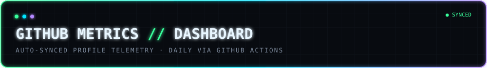
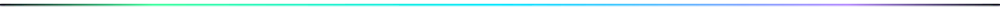

<!--
  ============================================================================
  GITHUB METRICS DASHBOARD — profile README for Navin-J48
  ============================================================================
  Every number on this page is real, sourced from one of two places:
    - dashboard-*.svg              -> generated by .github/workflows/metrics.yml
    - github-readme-stats / streak-stats -> hosted services queried live
      on every page load, keyed to this account
  Nothing on this page is hardcoded or invented.
  ============================================================================
-->

<!-- BANNER -->

 

<table width="100%">
<tr>

<!-- ======================= LEFT COLUMN ======================= -->
<td width="26%" valign="top">

<!-- PROFILE -->

### `Navin-J48`

**Full-Stack / Systems Developer**

Building things across the stack — from low-level C/C++ to
React front ends and Firebase-backed mobile apps.
Currently shipping, always learning.

<!-- TECHNOLOGY STACK -->
#### `> tech_stack`

Icons served live by <a href="https://skillicons.dev">skillicons.dev</a> — no static images to maintain.

</td>

<!-- ======================= CENTER COLUMN ======================= -->
<td width="48%" valign="top">

<!-- CONTRIBUTION CALENDAR -->
#### `> code_flux_calendar`

<!-- ACTIVITY -->
#### `> activity_pulse`

<!-- PROJECTS -->
#### `> project_spotlight`

Sourced from your real pinned repositories (see <code>plugin_repositories_pinned</code> in the workflow). Pin repos at <code>github.com/Navin-J48</code> → "Customize your pins" to control what shows here.

</td>

<!-- ======================= RIGHT COLUMN ======================= -->
<td width="26%" valign="top">

<!-- STATISTICS -->
#### `> account_overview`

#### `> streak`

#### `> top_languages`

#### `> languages_(in_depth)`

</td>

</tr>
</table>

Dashboard auto-refreshes daily via GitHub Actions ·
<a href="./.github/SETUP.md">setup guide</a> ·
built with <a href="https://github.com/lowlighter/metrics">lowlighter/metrics</a>,
<a href="https://github.com/anuraghazra/github-readme-stats">github-readme-stats</a>,
<a href="https://github.com/DenverCoder1/github-readme-streak-stats">streak-stats</a> and
<a href="https://skillicons.dev">skillicons.dev</a>

